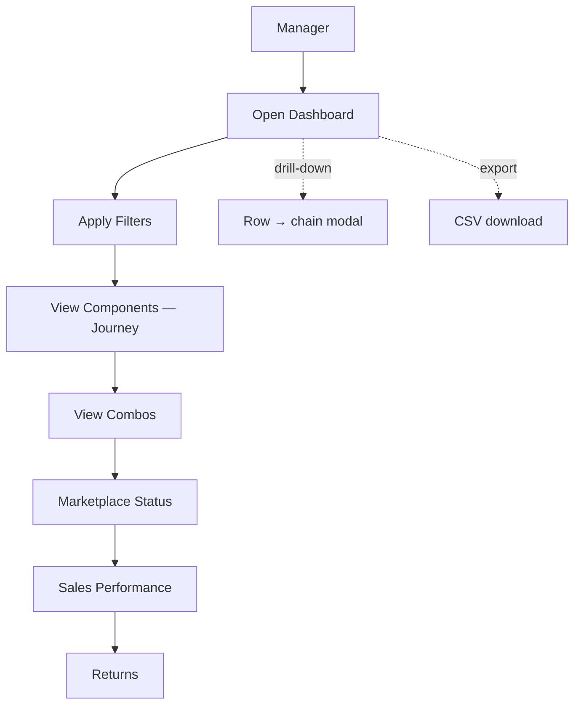

# Dashboard User Workflow

**Title:** Dashboard User Workflow
**Purpose:** Describe how a manager uses the dashboard end-to-end — from opening it to reviewing returns.
**Business Question:** *"How does a manager navigate the dashboard to answer 'what happened to our new products from supplier to customer?'"*

---

## User Journey Diagram

```
        MANAGER
           │
           ▼
    Open Dashboard  ──────────────►  6 KPIs + Journey Funnel + Sales Trend
           │
           ▼
    Apply Filters   ──────────────►  Period / Marketplace / Supplier / Container / Status / Search
           │
           ▼
   View Components  ──────────────►  Component Journey (349) · supplier→PO→container→market · sort/drill
           │
           ▼
     View Combos    ──────────────►  Combo Creation (6,274) · parent parts · orders/sales/returns
           │
           ▼
    Marketplace     ──────────────►  Listed 16,015 vs Non-Listed 8,596 · per channel
           │
           ▼
       Sales        ──────────────►  97,050 orders · £2,304,870 · units · AOV · top SKUs
           │
           ▼
      Returns       ──────────────►  4,569 lines · Amazon/eBay/Shopify
```

### Mermaid (renderable)


## Step-by-Step
1. **Open Dashboard** — headline KPIs and the journey funnel give an immediate state-of-play; click any funnel stage or KPI card to jump to its page.
2. **Apply Filters** — narrow by reporting period (fixed 2026-03-01→Today), marketplace, supplier, container, status, or free-text SKU/Component/ASIN search. Filters reset pagination and re-render.
3. **View Components** — the Component Journey table lists all 349 new components with full lineage; sort by Created/Combos/Markets, page through, and click a row to open its supplier→PO→container→component→combos→markets chain.
4. **View Combos** — Combo Creation shows the 6,274 combos built from new components, their parent parts, and orders/sales/returns; drill into any combo to see its components.
5. **Marketplace** — see listed vs non-listed counts per channel to spot missed visibility.
6. **Sales** — orders, revenue, units, AOV, and top-selling SKUs for the period.
7. **Returns** — return lines by channel to understand the post-purchase "travel" of the product.
8. **Anytime** — Export the current dataset to CSV; toggle light/dark theme; collapse the sidebar.

## Roles
- **Primary user:** Manager / business owner (read + explore).
- **Support:** Developer (refreshes snapshot), Data reviewer (validates values).

---

| Field | Value |
|---|---|
| **Source** | `dashboard/script.js` view router, filters, drill-downs; `dashboard/index.html` |
| **Evidence** | `documentation/dashboard_architecture.md`; `evidence/dashboard_screenshots.md` |
| **Status** | ✅ COMPLETE — all steps implemented |
| **Owner** | Dashboard Development Team |
| **Reviewer** | Varmen |
| **Next Step** | Add a saved-filter / bookmark feature for recurring manager views |
| **Pass/Fail Rule** | PASS when a manager can complete steps 1–8 without a dead end or placeholder value |
| **Known Limitations** | Reporting period is fixed to the snapshot window; impressions/clicks not yet shown on Sales |
