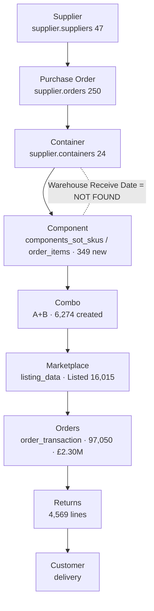

# Supplier-to-Customer Workflow Diagram

**Title:** Supplier-to-Customer Workflow
**Purpose:** Provide the canonical workflow diagram of the product journey with the data source at each stage.
**Business Question:** *"What is the exact sequence from supplier to customer, and what backs each step?"*

---

## Workflow Diagram

```
┌─────────────────┐
│    SUPPLIER     │  supplier.suppliers (47)
└────────┬────────┘
         ▼
┌─────────────────┐
│ PURCHASE ORDER  │  supplier.orders (250 · 99 since Mar)
└────────┬────────┘
         ▼
┌─────────────────┐
│    CONTAINER    │  supplier.orders.container_id → supplier.containers (24 · 16 final)
└────────┬────────┘
         ▼
┌─────────────────┐
│    COMPONENT    │  components_sot_skus (1,813) / supplier.order_items (3,826) · 349 new since Mar
└────────┬────────┘
         ▼
┌─────────────────┐
│      COMBO      │  combo sku = A+B (split '+') · 6,274 created since Mar
└────────┬────────┘
         ▼
┌─────────────────┐
│   MARKETPLACE   │  listing_data · Amazon / eBay / Shopify / B&Q · Listed 16,015 / Non-Listed 8,596
└────────┬────────┘
         ▼
┌─────────────────┐
│     ORDERS      │  order_transaction · 97,050 orders · £2,304,870 · AOV £23.75
└────────┬────────┘
         ▼
┌─────────────────┐
│     RETURNS     │  amazon/ebay/shopify_returns + return_by_cs_team · 4,569 lines
└────────┬────────┘
         ▼
┌─────────────────┐
│    CUSTOMER     │  delivery endpoint ("customer's home")
└─────────────────┘
```

### Mermaid (renderable)


## Stage → Source → Join
| Stage | Source | Join to next |
|---|---|---|
| Supplier | `supplier.suppliers` | `suppliers.id = orders.supplier_id` |
| Purchase Order | `supplier.orders` | `orders.id = order_items.order_id` |
| Container | `supplier.containers` | `orders.container_id = containers.id` |
| Component | `components_sot_skus` / `supplier.order_items` | `sku` |
| Combo | `'+'` SKU pattern | split `sku` → `components_sot_skus.sku` |
| Marketplace | `listing_data` | `sku`/`mapped_sku`; `ref_id`+`which_channel` |
| Orders | `order_transaction` | `sku`; `order_id` |
| Returns | returns tables | `order_id` / `sku` |
| Customer | endpoint | — |

**Limitation on the diagram:** the dotted link between Container and Component marks **Warehouse Receive Date = NOT FOUND** (only `status_arrived` exists).

---

| Field | Value |
|---|---|
| **Source** | Verified `supplier.*` + `public.*` tables (2026-07-21) |
| **Evidence** | `documentation/business_workflow.md`; `evidence/postgres_discovery_evidence.md` |
| **Status** | ✅ COMPLETE — 8 sourced stages + endpoint |
| **Owner** | Dashboard Development Team; receive-date gap → Tamilchelvan |
| **Reviewer** | Varmen |
| **Next Step** | Insert a "Warehouse Receive" node once the receive-date source exists |
| **Pass/Fail Rule** | PASS when each stage maps to a verified source and the gap is shown on the diagram |
| **Known Limitations** | Receive-date link missing; combo stage derived from SKU pattern |
